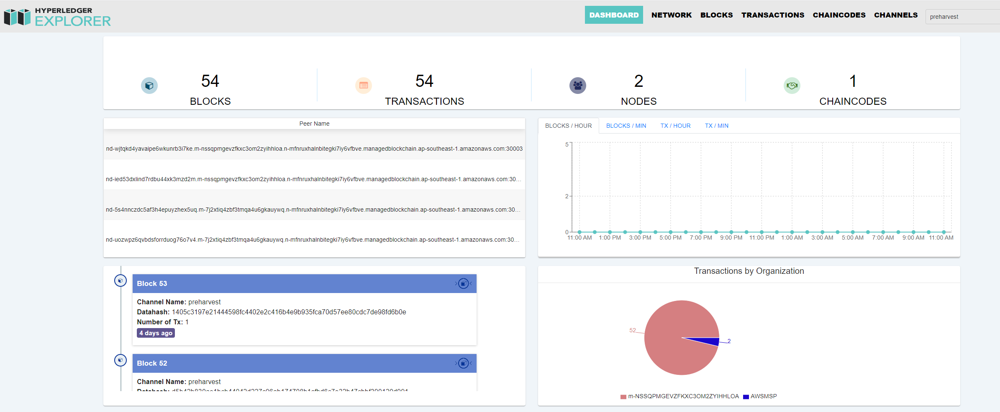

# Implement transaction visualization for AWS Manged Blockchain on EC2 Instance 

The "Hyperledger Explorer" is installed to visualize the Blockchain and looked at the AWS Managed Blockchain. Usually, Hyperledger Explorer is used to track and trace the transactions, chaincode and activities in Hyperedger Fabric network.

## Freatures

-   _Blockchain network visualization_: Hyperledger Explorer provides a graphical representation of the blockchain network, including the nodes, channels, and transactions.
-   _Real-time data monitoring_: The Explorer provides real-time data on the status of the network, including the number of transactions, blocks, and network activity.
-   _Search and filtering_: Users can search and filter blockchain data to quickly find specific transactions, blocks, and other information.
-   _Smart contract management_: Hyperledger Explorer allows users to deploy, invoke, and query smart contracts on the blockchain.
-   _User management_: The Explorer provides a user-friendly interface for managing user identities and permissions on the blockchain network.
-   _Data export_: Hyperledger Explorer allows users to export data from the blockchain network in various formats, including CSV and JSON.
-   _Secure access_: The Explorer provides secure access to the blockchain network, with user authentication and authorization mechanisms in place.

## Installing Hyperledger Explorer

As introduced in the official website of [Hyperledger Explorer](https://github.com/hyperledger-labs/blockchain-explorer) , there are two way to install Hyperledger Explorer: i) install using the code base clone from github, and ii) using Docker for installation. From my experiences, installation from code base raise quite a lot of issues regarding to versions of required tools, path, etc. Meanwhile, using docker reduces complexity and save time.

## Installation of prerequisite software

-   Running AWS Managed Blockchain or Hyperledger Fabric v^2.2
-   Docker CE v.20.10.22 / Docker compose v2.15.1
-   nodejs v16.19 or higher
-   PostgreSQL lastest version or AWS RDS PostgreSQL instance
-   jq ([https://stedolan.github.io/jq/](https://stedolan.github.io/jq/))

## docker and docker-compose Installation

    $ sudo apt update
    $ sudo apt install apt-transport-https curl gnupg-agent ca-certificates software-properties-common -y
    $ curl -fsSL [https://download.docker.com/linux/ubuntu/gpg](https://download.docker.com/linux/ubuntu/gpg) | sudo apt-key add -
    $ sudo apt install docker-ce docker-ce-cli containerd.io -y
    $ sudo usermod -aG docker $USER
    $ docker version

## Nodejs installation

Hyperledger Explorer is a Node.js application implemented using [Hyperledger Fabric Node SDK etc.](https://fabric-sdk-node.github.io/)

The Node.js runtime has already been installed as prerequisite software for the Hyperledger Fabric official sample, but as a point of caution, if you do not follow the official procedure and make it a compatible version, it `npm install`may not work properly)

    sudo apt -y purge nodejs
    curl -sL https://deb.nodesource.com/setup_8.x | sudo bash -
    sudo apt -y install nodejs

## postgreSQL installation

There are two options to deploy postgres SQL, using Amazon RDS PostgreSQL instance and using local postgresql

### Amazon RDS PostgreSQL instance

First, we create a Amazon RDS PostgreSQL instance by following the office AWS docs [AWS RDS PostgreSQL Guideline](https://docs.aws.amazon.com/AmazonRDS/latest/UserGuide/CHAP_GettingStarted.CreatingConnecting.PostgreSQL.html), then connect the database with Hyperledger Explorer EC2 instance. Note that the AWS RDS and Explorer EC2 instance should be in the same VPC.

For example, run a command below to create a database:

```
$ cd ~/fabric-explorer/aws-rds
$ aws rds create-db-instance \
	--db-name $DATABASE \
    --engine postgres \
    --db-instance-identifier $DBINSTANCENAME \
    --allocated-storage 250 \
    --db-instance-class db.m6i.large \
    --vpc-security-group-ids $VPC \
    --db-subnet-group $SUBNETGROUP \
    --master-username $USER \
    --master-user-password $PASSWD \
    --backup-retention-period 3
```

or run the scripte createdb.sh to create a database and create tables for the database

```
$ cd ~/fabric-explorer/aws-rds
$ ./createdb.sh
```

### Install postgresql on the Explorer EC2 intance

Hyperledger Explorer periodically query data from Fabric ledger, receive event notifaction, and store information in a local DB, e.g, postgresql DB

    sudo apt -y install locate postgresql
    sudo systemctl enable postgresql
    sudo service postgresql start

## Setup a Hyperlfedger Fabric Client

In order to connect with the running AWS Managed Blockchain network, you need to setup your EC2 instance to be a Fabric client. The detail is desrcibed in detail in:
https://docs.aws.amazon.com/managed-blockchain/latest/hyperledger-fabric-dev/get-started-create-client.html
Then, check connectivity between Hyperledger Fabric Client with the AWS Managed Blockchain network:

    $ aws managedblockchain get-member \
     --network-id n-XXXXXXXXXXXXXXXXXXXXXXXXXX \
     --member-id m-XXXXXXXXXXXXXXXXXXXXXXXXXX \
     --query  "Member.FrameworkAttributes.Fabric.CaEndpoint"
     "ca.m-XXXXXXXXXXXXXXXXXXXXXXXXXX .n-XXXXXXXXXXXXXXXXXXXXXXXXXX .managedblockchain.ap-southeast-1.amazonaws.com:30002"

Get the CA information

```
$ curl https://ca.m-xxxxxxxxxxxxxxxxxxxxxxxxxx.n-xxxxxxxxxxxxxxxxxxxxxxxxxx.managedblockchain.ap-southeast-1.amazonaws.com:30002/cainfo -k
{"result":{"CAName":"m-XXXXXXXXXXXXXXXXXXXXXXXXXX","CAChain":"","Version":""}
```

Download "`managedblockchain-tls-chain.pem`" to $HOME folder

    $ aws s3 cp s3://MyRegion.managedblockchain/etc/managedblockchain-tls-chain.pem  /home/ubuntu/managedblockchain-tls-chain.pem

Use the CA endpoint, administrator profile, and the certificate file to enroll the member administrator using the `fabric-ca-client enroll` command, as shown in the following example:

    $ fabric-ca-client enroll \
    -u 'https://AdminUsername:AdminPassword@$CASERVICEENDPOINT' \
    --tls.certfiles /home/ubuntu/managedblockchain-tls-chain.pem
    -M /home/ubuntu/admin-msp

## Configure Hyperledger Explorer

Create a new folder named "fabric-explorer"

    $ mkdir fabric-explorer
    $ cd fabric-explorer

Copy `managedblockchain-tls-chain.pem` and admin-msp to `/fabric-explorer` folder

    $ cp -r /home/ubuntu/managedblockchain-tls-chain.pem /home/ubuntu/fabric-explorer/
    $ cp -r /home/ubuntu/admin-msp /home/ubuntu/fabric-explorer/

Create connection-profile folder

     $ mkdir connection-profile
     $ cd connection-profile
     $ nano profile-cotton.json

```json
{
    "name": "cotton-dev",
    "version": "1.0.0",
    "license": "Apache-2.0",
    "client": {
        "tlsEnable": true,
        "caCredential": {
            "id": "<Admin>",
            "password": "<Password>"
        },
        "adminCredential": {
            "id": "<ExplorerAdmin>",
            "password": "<ExplorerPassword>"
        },
        "enableAuthentication": true,
        "organization": "<MEMBERID>",
        "channel": "<CHANNEL>",
        "connection": {
            "timeout": {
                "peer": {
                    "endorser": "300"
                },
                "orderer": "300"
            }
        }
    },
    "channels": {
        "preharvest": {
            "peers": {
                "<PEERNODEID>": {}
            }
        }
    },
    "organizations": {
        "<MEMBERID>": {
            "mspid": "<MEMBERID>",
            "peers": ["<PEERNODEID>"],
            "fullpath": true,
            "adminPrivateKey": {
                "path": "/path/to/private/key_sk"
            },
            "signedCert": {
                "path": "/path/to/signed/cert"
            }
        }
    },
    "peers": {
        "<PEERNODEID>": {
            "url": "<PEERSERVICEENDPOINT>",
            "eventUrl": "PEEREVENTENDPOINT",
            "tlsCACerts": {
                "path": "managedblockchain-tls-chain.pem"
            },
            "grpcOptions": {
                "ssl-target-name-override": "<PEERSERVICEENDPOINTNOPORT>",
                "discovery-as-localhost": "false"
            }
        }
    },
    "orderers": {
        "orderer": {
            "url": "<ORDERINGSERVICEENDPOINT>",
            "grpcOptions": {
                "ssl-target-name-override": "<ORDERINGSERVICEENDPOINTNOPORT>"
            },
            "tlsCACerts": {
                "path": "managedblockchain-tls-chain.pem"
            }
        }
    },
    "certificateAuthorities": {
        "<CASERVICEID>": {
            "url": "CASERVICEENDPOINT",
            "httpOptions": {
                "verify": true
            },
            "tlsCACerts": {
                "path": "managedblockchain-tls-chain.pem"
            },
            "caName": "<CASERVICEID>"
        },
        "registrar": {
            "affiliation": "<NameofCompliance>",
            "enrollId": "<CAADMIN>",
            "enrollSecret": "<CAPASSWORD>",
            "role": "admin"
        }
    }
}
```

Allow the added settings to be loaded

    $ nano config.json
    ``` json
    {
    "network-configs": {
    	"cotton-dev": {
    		"name": "cotton-dev",
    		"profile": "./connection-profile/profile-cotton.json",
    		"enableAuthentication": true
    	}
    },
    "license": "Apache-2.0"
    }
    ```

-   Create db-explorer.yaml

```yaml
# SPDX-License-Identifier: Apache-2.0
version: '2.1'

volumes:
    pgdata:
    walletstore:

networks:
    mynetwork.com:
        name: cotton-dev
        external: true

services:
    explorerdb.mynetwork.com:
        image: hyperledger/explorer-db:latest
        container_name: explorerdb.mynetwork.com
        hostname: explorerdb.mynetwork.com
        environment:
            - DATABASE_DATABASE=fabricexplorer
            - DATABASE_USERNAME=hppoc
            - DATABASE_PASSWORD=password
        healthcheck:
            test: 'pg_isready -h localhost -p 5432 -q -U postgres'
            interval: 30s
            timeout: 10s
            retries: 5
        volumes:
            - pgdata:/var/lib/postgresql/data
        networks:
            - mynetwork.com
```

Create explorer-compose.yaml file

```yaml
# SPDX-License-Identifier: Apache-2.0
version: '2.1'

volumes:
    pgdata:
    walletstore:

networks:
    mynetwork.com:
        name: cotton-dev
        external: true

services:
    explorer.mynetwork.com:
        image: hyperledger/explorer:latest
        container_name: explorer.mynetwork.com
        hostname: explorer.mynetwork.com
        environment:
            - DATABASE_HOST=explorerdb.mynetwork.com
            - DATABASE_DATABASE=fabricexplorer
            - DATABASE_USERNAME=hppoc
            - DATABASE_PASSWD=password
            - LOG_LEVEL_APP=info
            - LOG_LEVEL_DB=info
            - LOG_LEVEL_CONSOLE=debug
            - LOG_CONSOLE_STDOUT=true
            - CORE_PEER_TLS_ROOTCERT_FILE=/opt/home/managedblockchain-tls-chain.pem
            - CORE_PEER_MSPCONFIGPATH=/opt/home/admin-msp
            - DISCOVERY_AS_LOCALHOST=false
            - PORT=${PORT:-8443}
        volumes:
            - ./config.json:/opt/explorer/app/platform/fabric/config.json
            - ./connection-profile:/opt/explorer/app/platform/fabric/connection-profile
            - ./managedblockchain-tls-chain.pem:/opt/explorer/managedblockchain-tls-chain.pem
            - ./admin-msp/:/opt/explorer/admin-msp/
            - ./appconfig.json:/opt/explorer/app/appconfig.json
            - ./ssl-certs:/opt/explorer/app/ssl-certs
            - walletstore:/opt/explorer/wallet
        ports:
            - ${PORT:-8443}:${PORT:-8443}
        networks:
            - mynetwork.com
```

Now, you should have the following files and directory structure.

    /connection-profile/profile-cotton.json
    /aws-rds/
    /admin-msp/
    config.son
    db-explorer.yaml
    explorer-compose.yaml

## Start container services

Run the following to start up explore and explorer-db services:

    $ docker-compose -f local-RDS-db-component.yaml up -d (For local postgresql only))
    $ docker-compose -f explorer-compose.yaml up -d

## Enabled HTTPS for Hyperledger Explorer

Create a folder `./ssl-cert` folder in `fabric-explorer` :

    $ cd fabric-explorer
    $ mkdir ./ssl-certs

Create a configuration file

     $ cd ./ssl-certs
     $ nano config.cnf
     [req]
    distinguished_name = req_distinguished_name
    x509_extensions = v3_req
    prompt = no
    [req_distinguished_name]
    C = AU
    ST = NSW
    L = Sydney
    O = CSIRO
    OU = Data61
    CN = ec2-13-212-127-178.ap-southeast-1.compute.amazonaws.com
    [v3_req]
    keyUsage = critical, digitalSignature, keyAgreement
    extendedKeyUsage = serverAuth
    subjectAltName = @alt_names
    [alt_names]
    DNS.1 = ec2-13-212-127-178.ap-southeast-1.compute.amazonaws.com

Generate key file.

    $openssl req -newkey rsa:2048 -nodes -keyout privatekey.pem -x509 -days 365 -out certificate.pem -config config.cnf -sha256

Edit file appconfig.json
Update config options sslEnabled : true | false, to enable, or disable HTTPS.

    {
    	"sslEnabled": true,
    	"sslCertsPath": "./ssl-certs",
    	"host": "127.0.0.1",
    	"port": "8443",
    	"license": "Apache-2.0"
    }

## Resuts

If succeess, you can login to Hyperledger Explorer dashboard


Then, you can monitor the network via visualization as follow:



## Refererence

[1] AWS Managed Blockchain Official document: https://docs.aws.amazon.com/managed-blockchain/latest/hyperledger-fabric-dev/what-is-managed-blockchain.html

[2] AWS Manged Blockchain tutorial: https://aws.amazon.com/blogs/database/running-hyperledger-explorer-on-amazon-managed-blockchain/
